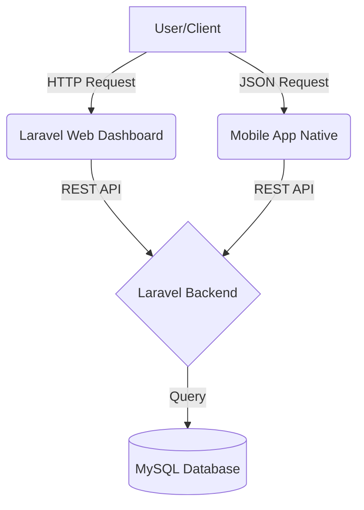
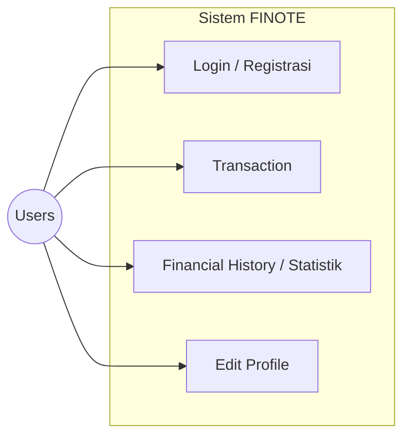
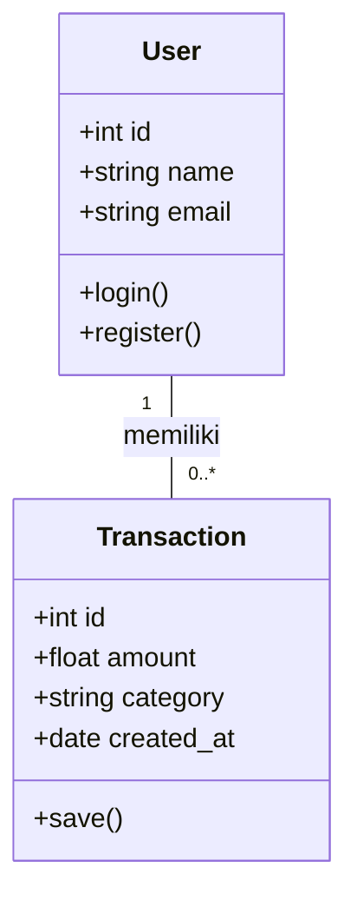
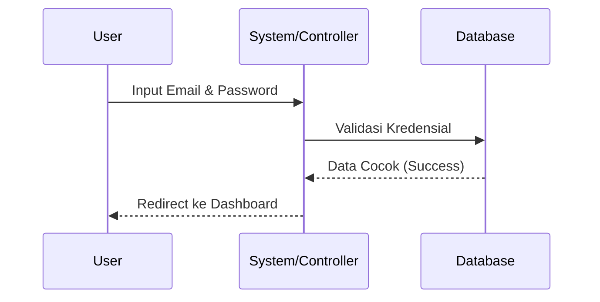
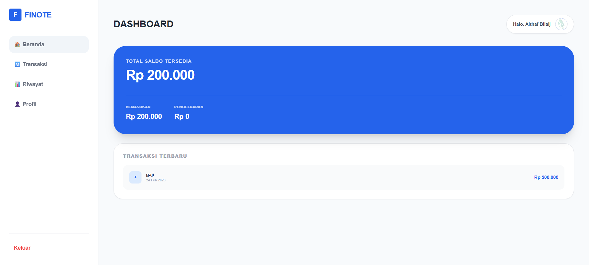
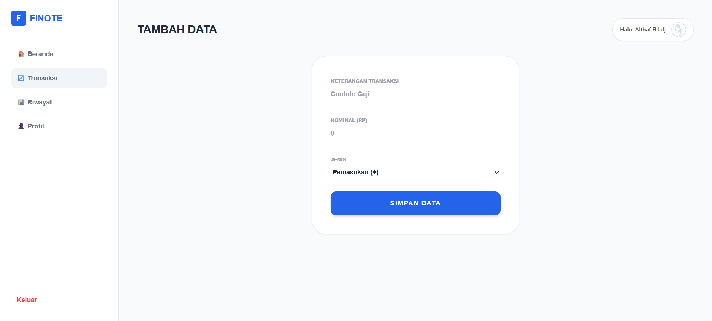
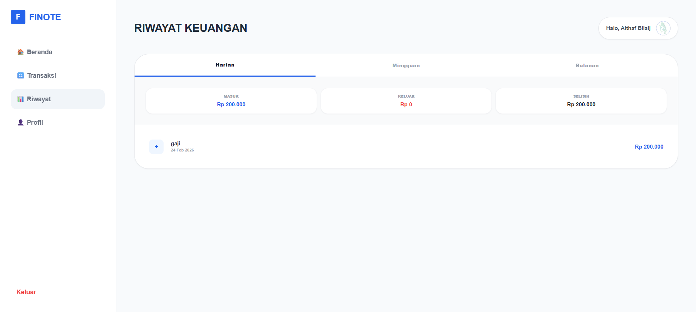
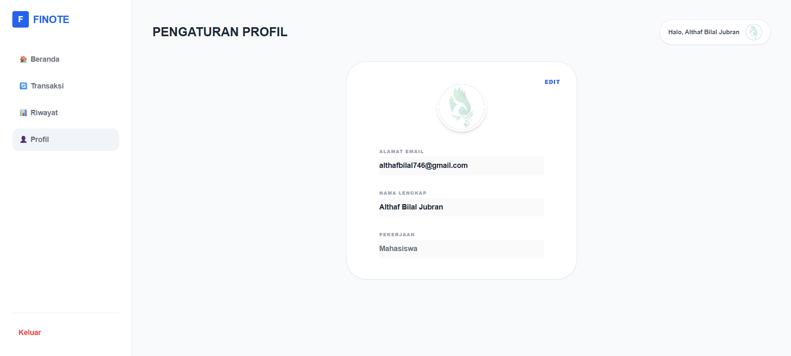

# 📑 FINOTE APPLICATION

## 💰 DESKRIPSI
**FINOTE APPLICATION** adalah platform manajemen keuangan pribadi yang dirancang untuk membantu pengguna melacak transaksi masuk dan keluar secara efisien. Pencatatan keuangan dapat dilihat mulai dari pencatatan harian hingga bulanan.

## 🎯 TUJUAN
* Memberikan kemudahan bagi pengguna dalam mencatat riwayat keuangan harian.
* Menyediakan jalur data melalui **REST API** untuk pengembangan masa depan.
* Mengimplementasikan sistem autentikasi yang aman untuk menjaga privasi data.

## 🚀 FITUR APLIKASI
* **✅ Autentikasi**: Login & Register dengan *session-based auth*.
* **📊 Dashboard**: Ringkasan transaksi dan total saldo secara real-time.
* **🌐 REST API**: Endpoint `/api/users` untuk akses data user (JSON).
* **🎨 Desain Modern**: Antarmuka responsif menggunakan **Tailwind CSS**.

## 🛠️ TEKNOLOGI YANG DIGUNAKAN
| Komponen | Teknologi |
| :--- | :--- |
| **Framework** | Laravel 10/11 |
| **Database** | MySQL |
| **Frontend** | Tailwind CSS & Blade Templating |
| **API Format** | JSON (RESTful API) |

## 📁 Struktur Proyek
* `dashboard-finote/` : Proyek utama berbasis framework Laravel.
* `versi_native/` : Versi aplikasi menggunakan PHP Native murni.

## 📊 UML Diagram
### 1. Arsitektur Diagram
Diagram ini menunjukkan interaksi antara Client, Backend Laravel, dan Database.

### 2. Use Case Diagram
Diagram ini menunjukkan fungsionalitas utama aplikasi interaksi users dengan sistem.

### 3. Class Diagram
Struktur data utama yang digunakan untuk mengelola informasi pengguna dan transaksi.

### 4. Sequence Diagram
Diagram ini menunjukkan urutan proses autentikasi saat pengguna masuk ke aplikasi.

## 🎨 MOCK-UP / SCREENSHOTS WEBSITE APPLICATION
Berikut adalah tampilan antarmuka dari **FINOTE APPLICATION**.

### 1. Login dan Register
Sistem autentikasi untuk keamanan data pengguna.

### 2. Halaman Utama (Home)
Menampilkan ringkasan saldo dan navigasi utama aplikasi.

### 3. Input Transaksi
Fitur untuk mencatat data keuangan baru ke dalam sistem.

### 4. Riwayat Transaksi
Daftar seluruh catatan keuangan masuk dan keluar secara mendetail (harian, mingguan, bulanan, total).

### 5. Profil Pengguna
Halaman pengaturan informasi dan akun pengguna.

## DEVELOPER
Althaf Bilal Jubran
